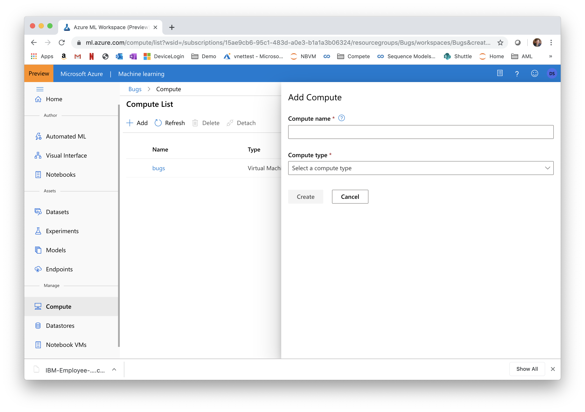
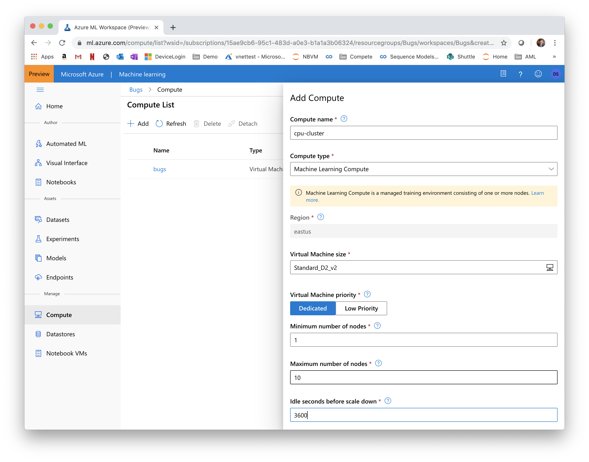

# Setting up the Compute Targets

## Prerequisites
To run through this workshop, you will need an Azure subscription and an Azure ML workspace. See instructions on how to create a workspace [here](https://docs.microsoft.com/en-us/azure/machine-learning/service/how-to-manage-workspace).

## Creating an AzureML compute cluster
We will do a number of actions that require a compute target to be exectuted on. We will start by creating a cluster of CPU VMs.

1. Navigate to 'Compute' in the Manage/Compute section and click 'Add' 

1. Call the cluster 'testJan2020' and choose the type 'Machine Learning Compute'. 
    - For machine size choose 'Standard_D2_v2' (that is an inexpensive general purpose VM size at about $0.14/hour). 
    - Set the 'minimum number of nodes' to 0 and the 'maximum number of nodes' to 10. That way the cluster will scale automatically to up to 10 nodes as jobs require them.
    - Set the 'Idle seconds before scale down' to 7200. That means that nodes will be kept around for 3 hours before they are spun down. That way, during our workshop, jobs won't have to wait for spin-up. Make sure that number is lower if you are using a more expensive VM size.

## Creating an Attached compute cluster (Azure Databricks)
The data preparation will be pipelined into the AzureML and executed in Azure Databricks, so we need to populate it

1. Navigate to 'Attached Compute' in the Manage/Compute section and click 'Add' 

2. Call the cluster 'mydatabricks' and choose the type 'Azure Databricks'. 
    - Pick your Databricks workspace within the Resource Group
    - Create a PAT token in Azure Databricks (under User Settings menu) and paste it here