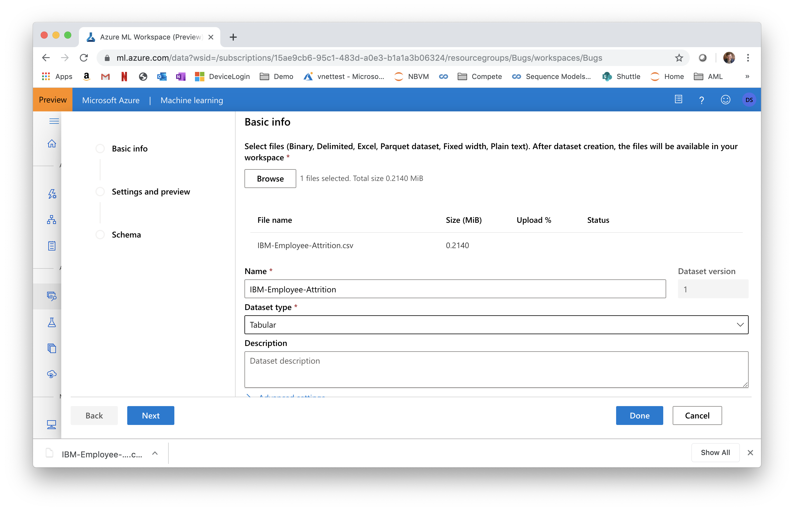
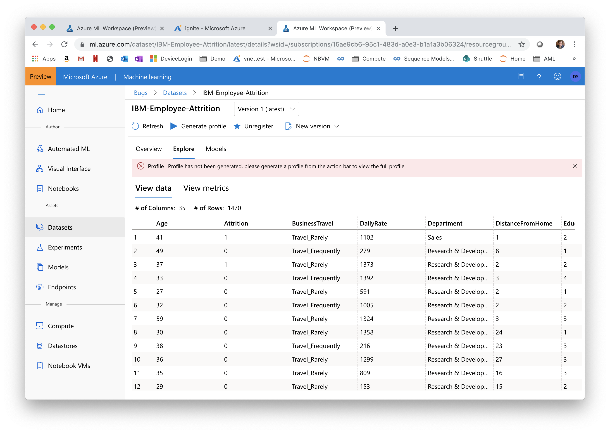

# Datasets and Datastores

The AzureML studio allows the user to manage their dataset and datastores directly inside the portal. 

A Dataset is a resource for exploring, transforming and managing data in Azure Machine Learning. 
Datasets enable:

- Easy access to data: without worrying about connection strings or data paths. Only keep a single copy of data in the storage service of your choice.

- Training with big data: seamless integration with Azure Machine Learning features like labelling, training products and pipelines. Users can share and reuse datasets in various experiments.

- Tracking data usage: Azure ML automatically tracks which version of the dataset was used for the ML experiment and produced which model.

## Uploading a Dataset to AzureML studio

1. Download the churn dataset by clicking on this link: and saving the file to disk.

1. Navigate to the left pane of your workspace. Select Datasets under the Assets section. 

1. Click on 'Create dataset' and choose 'From local files'. 

1. Click 'Browse', choose the file you had downloaded, name the dataset **'telcochurn'**, and then click 'Done' to complete the creation of the new dataset. Make sure to leave the Type set to Tabular.

## Generating a Profile

1. Now, click on the newly created dataset and click 'Explore'. Here you can see the fields of the Tabular dataset.

1. To get more details (in particulare for larger datasets), click 'Generate profile', select the cluster you created and then click 'Generate' to generate profile information for this dataset. This will take little while, since the cluster needs to spin up a node, so we will move to the next task and come back to this later.

For more information on datasets, see the how-to for more information on creating and using Datasets. https://docs.microsoft.com/en-us/azure/machine-learning/service/how-to-create-register-datasets

# Datastores

Create a datastore to let Azure Databricks and AzureML over the same container to interexchange CSV, parquets, etc along the different e2e phases of the ML training

During this demo it is assumed that there is a previous Datastore called demoemea (in our case pointing to a simple blob storage account)