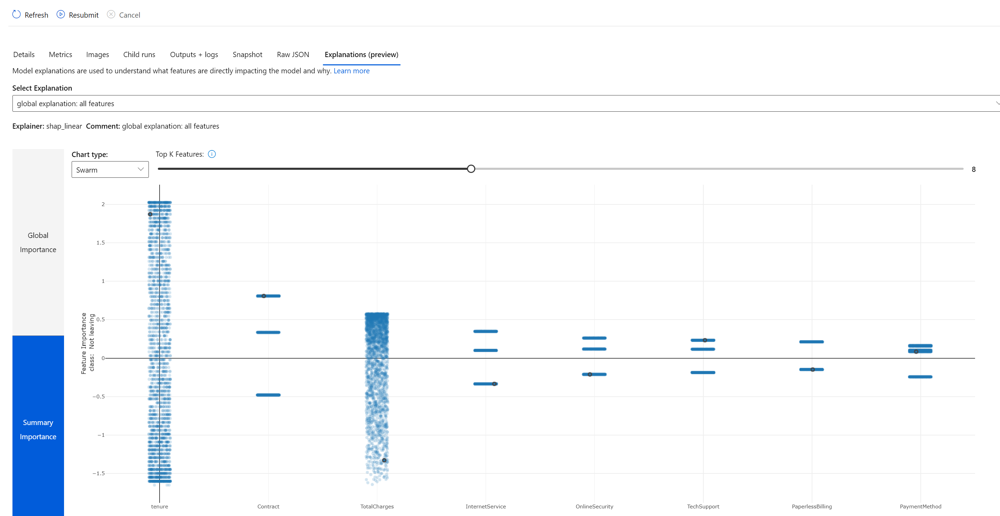
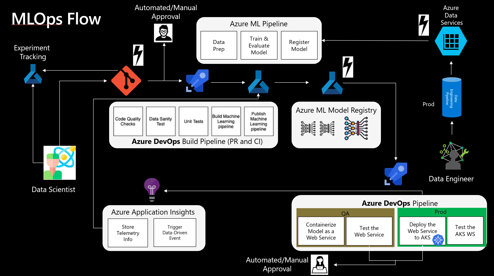

# MLops example

Note: This repo is a fork from https://github.com/danielsc/azureml-workshop-2019/ and inspired by Roman's article: https://towardsdatascience.com/churn-prediction-770d6cb582a5 , all the credit to them.

This repo provides a curated example of a MLops cycle where we train a model while showing main capabilities of AzureML and automate tedious tasks like data preparation (with Azure Databricks), model tracking, metric logging, explainabiliy, unit test, etc

Main addons on top of danielsc's repo:
- Addon of metric logging, to make them available in the model registry
- Addon of interpretability section, viewable in the AzureML unit

- Unit testing as AzureML pipeline
- Azure Function to trigger a build devops pipeline whenever our dataset changes (see blobtrigger code)
- Azure Databricks notebook orchestrated from AzureML pipeline to execute pySpark notebook
- Fix of Azure Devops build pipeline to use AzureML pipeline (and avoid calling the python script straightaway)
- Split of train, unitary test and register. Register only after sucessful tests, triggered with CLI as seen [here](https://docs.microsoft.com/en-us/cli/azure/ext/azure-cli-ml/ml/model?view=azure-cli-latest#ext-azure-cli-ml-az-ml-model-register)
- Enhance visibility with Azure Monitoring and Datadrift

E2E this is the MLops architecture we implement:

